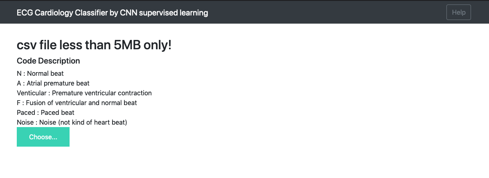
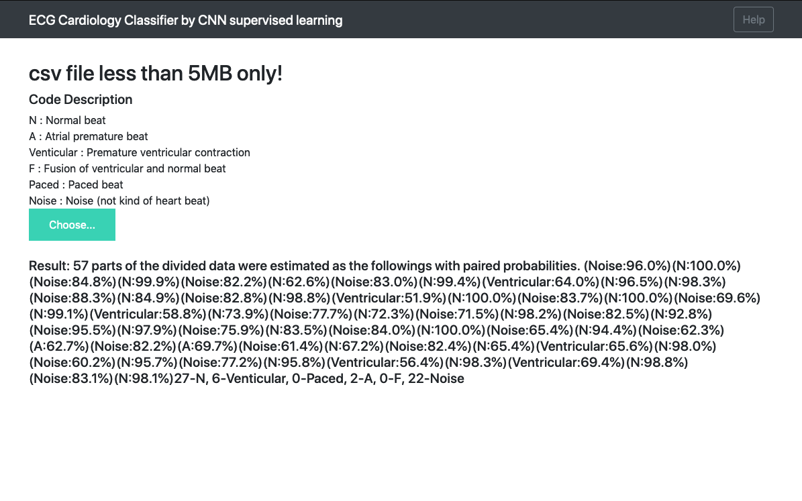

[](./LICENSE)

## ECG classification using MIT-BIH dataset 

This repo is an implementation of https://www.nature.com/articles/s41591-018-0268-3 and https://arxiv.org/abs/1707.01836

and focus on training using a MIT-BIH dataset. If you want to train using CINC or open irhythm data, see the open source which the authors of the original research paper have coded at https://github.com/awni/ecg

Introduction to MIT-BIH dataset at physionet : https://physionet.org/physiobank/database/mitdb/

### Dependency 

Consistent with the environment of Google colab with wfdb, deepdish installations and numpy reinstallation. 

- Python >= 3.6.7
- keras==2.2.5
- tensorflow==1.15.0 
- scikit-learn==0.21.3
- wfdb==2.2.1
- deepdish==0.3.6
- scipy==1.3.1
- numpy==1.15.4
- tqdm==4.36.1
- six==1.12.0
- Flask==1.1.1
- gevent==1.4.0
- werkzeug==0.16.0
- virtualenv==16.7.7


### Data setup and train 

I recommend using a vitual enviroment for Python, so run setup.sh in order to install and to activate it. 
```
$ git clone https://github.com/physhik/ecg-mit-bih.git
$ cd ecg-mit-bih
$ pip install virtualenv
$ virtualenv -p python ecg-env
$ source ./ecg-env/bin/activate
(ecg-env) $ pip install -r requrirements.txt
(ecg-env) $ python src/data.py --downloading True
(eng-env) $ python src/train.py
```
Now you have a trained model for ECG classification 


### Test

Predict an annotation of [CINC2017 data](https://physionet.org/challenge/2017/) or your own data(csv file)

It randomly chooses one of data, and predict the slices of the signal.

Run predict.py in the virtual environment we have already set up.
```
(ecg-env) $ python src/predict.py --cinc_download True
```
--cinc_download branch is used at first to download the CINC2017 data.

See src/config.py and customize your parameters or learn better way to train and test 


### Jupyter notebook example

In case, you do not have a GPU above a decent performance, you might be able to use Google colab. Follow the [Jupyter notebook](https://github.com/physhik/ecg-mit-bih/blob/master/src/practice/ecg_mit.ipynb).


### Flask web app

The flask web app is based on the 500 stared [Github repo](https://github.com/mtobeiyf/keras-flask-deploy-webapp). 

#### Run app.py
```
(ecg-env) $ python src/app.py
```



and choose a csv heart heat signal and click predict, and see the result. 



I have put one csv file in static/asset directory. The first value of the column become sample rate of the web app. If you use your own heart beat csv file, insert the sample at the first, too.   


### Using Docker, Buld and run an image for the ECG trained model.

After installation of Docker, 

```
$ docker build -t ecg-app .  
$ docker run -d -p 5000:5000 ecg-app
```

### Pull an built-image from Docker hub

Or for your convenience, pull the image from Docker hub by 

```
$ docker pull physhik/ecg-app:1 
$ docker run -d -p 5000:5000 physhik/ecg-app:1
```

and then open http://localhost:5000 after a while installing the app in the container. 


### Introduction to ECG 

I presented a bit more about ECG classfications on my personal blog, http://physhik.github.io 

Find the posts from tags or categories easily.  

### Reference to 

The original research papers
https://www.nature.com/articles/s41591-018-0268-3
https://arxiv.org/abs/1707.01836

The open source by authors
https://github.com/awni/ecg

also noticable 
https://github.com/fernandoandreotti/cinc-challenge2017/tree/master/deeplearn-approach
